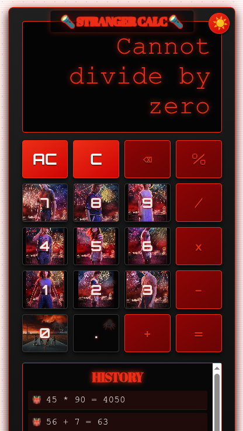

# <span style="color: #8b0000;"> Stranger Things Inspired Calculator</span>


*Screenshot: Dark mode calculator with neon glow effects, character portraits on digit buttons, and history panel.*

A retro-futuristic calculator themed around *Stranger Things*, featuring neon glows, character portraits on buttons, dark/light themes, calculation history, and full keyboard support. Built with vanilla HTML, CSS, and JavaScript for accessibility and performance.

Live Demo: [View on GitHub Pages](https://yourusername.github.io/stranger-calculator/)

## Features
- **Themed Design**: Dark mode with *Stranger Things* wallpaper, neon red glows, and flickering animations. Toggle to light mode with blue accents.
- **Character Buttons**: Digit buttons (0-9, .) feature portraits of Eleven, Will, Mike, Dustin, Max, Lucas, Vecna, Steve, and Nancy.
- **Operations**: Basic arithmetic (+, -, ×, ÷), percent (%), clear (C/AC), backspace (⌫), and equals (=).
- **History Log**: Saves up to 10 recent calculations. Click any entry to replay the expression.
- **Accessibility**: ARIA labels, keyboard navigation, focus indicators with neon glow, and reduced motion support.
- **Keyboard Shortcuts**: Full numpad/keyboard support (digits, operators, Enter for =, Backspace, C/clear, Esc for AC).
- **Local Storage**: Persists theme and history across sessions.
- **Responsive**: Adapts to mobile screens with adjusted padding and font sizes.

## Installation
Use the package manager [Git](https://git-scm.com/) to clone the repository.

```bash
git clone https://github.com/Nurkamila/Stranger_Calc.git
cd Stranger_Calc
```

Open `index.html` in any modern web browser (Chrome, Firefox, Safari, Edge). No build tools or dependencies required—it's pure vanilla JS!

For development:
- Edit `styles.css` for custom themes or images.
- Modify `app.js` for additional operations (e.g., exponents).
- Add more history items by changing `this.history.slice(0, 10)`.

## Usage Notes
- **Basic Calculations**: Enter numbers using buttons or keyboard. Select an operator (+, -, ×, ÷, %) and continue with the next number. Press `=` or Enter to compute.
- **Chain Operations**: Supports sequential ops (e.g., 5 + 3 × 2 = 11). Automatically evaluates left-to-right.
- **Negative Numbers**: Press `-` first for negatives (e.g., -5 + 3).
- **Decimal & Percent**: Use `.` for decimals; `%` converts current input to percentage (e.g., 50% = 0.5).
- **Clear Functions**:
    - `C`: Clears current input (resets to 0, keeps previous ops).
    - `AC`: Full reset (clears everything, including history).
- **History Replay**: Click a history item to load the expression back into the display for editing/recalculation.
- **Theme Toggle**: Click the sun/moon icon (☀️/🌙) in the top-right to switch modes. Saved in browser storage.
- **Keyboard Tips**:
    - Digits: 0-9, .
    - Operators: +, -, *, / (use * for ×).
    - Evaluate: Enter or =.
    - Backspace: Delete last digit (or operator if at start).
    - Clear: C (current) or Shift+C (all).
    - Percent: % key.
    - Escape: Full clear.
- **Mobile**: Pinch-zoom works; buttons are touch-friendly. History scrolls vertically.

Pro Tip: For immersive play, pair with *Stranger Things* soundtrack—calculations feel like decoding Upside Down signals!

## Known Bugs & Limitations
1. **History Overflow**: Limited to 10 entries; older ones are discarded on new calculations. No export/print option.
2. **Image Loading**: Character portraits load from external Pinterest URLs—may fail if links break or ad-blockers interfere. Fallback to solid colors.
3. **Precision Issues**: JavaScript float precision (e.g., 0.1 + 0.2 = 0.30000000000000004) not rounded—results may show extra decimals.
4. **Replay Edge Cases**: Replaying complex chains (e.g., with % or negatives) may not perfectly restore state if interrupted.
5. **Accessibility Gaps**: Screen readers announce display changes via `aria-live`, but rapid keypresses might overwhelm. No voice output for results.